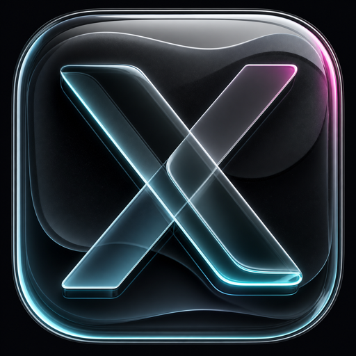
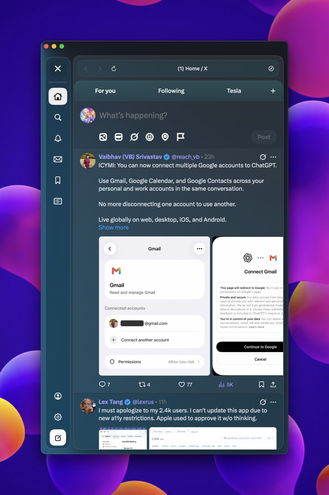

# XGlass

XGlass is an Apple Silicon macOS client shell for X.com with a native SwiftUI
interface inspired by macOS glass materials. It uses X.com's normal WebKit
session, so sign-in, two-factor authentication, and account controls remain
handled by X.com rather than a separate API credential flow.

## Preview

<p align="center">
  
</p>

<p align="center">
  
</p>

## Install

Download the latest arm64 `.dmg` or `.zip` from the [GitHub Releases page](https://github.com/appleforever11/XGlass/releases), move `XGlass.app` to `/Applications`, and launch it. XGlass requires macOS 14 or later.

After installation, use **XGlass > Check for Updates...** to check the
GitHub-hosted Sparkle appcast. Updates are accepted only when signed with the
embedded Sparkle public key.

## Build locally

```sh
swift package resolve
./script/test.sh
./script/build_and_run.sh
```

The build script stages the executable, icon, and `Sparkle.framework` updater
helpers into a complete `.app` bundle. `./script/build_and_run.sh --verify`
launches and verifies the local bundle. `./script/package_release.sh 1.0.0`
creates the Sparkle-compatible arm64 ZIP, and `./script/package_dmg.sh` creates
the installable DMG.

## Release automation

Pushing a tag such as `v1.0.1` runs
[the release workflow](.github/workflows/release.yml). It builds an arm64
release, signs the app, notarizes the ZIP and DMG, generates the Sparkle
appcast, and publishes the GitHub release.

The workflow expects these repository secrets:

- `APPLE_SIGNING_IDENTITY`
- `APPLE_CERTIFICATE_P12_BASE64`
- `APPLE_CERTIFICATE_PASSWORD`
- `APPLE_NOTARY_KEY_ID`
- `APPLE_NOTARY_ISSUER`
- `APPLE_NOTARY_KEY_P8_BASE64`
- `SPARKLE_PRIVATE_KEY`

None of these credentials belongs in Git. The public Sparkle key is stored in
`Sources/XGlass/Info.plist`.
